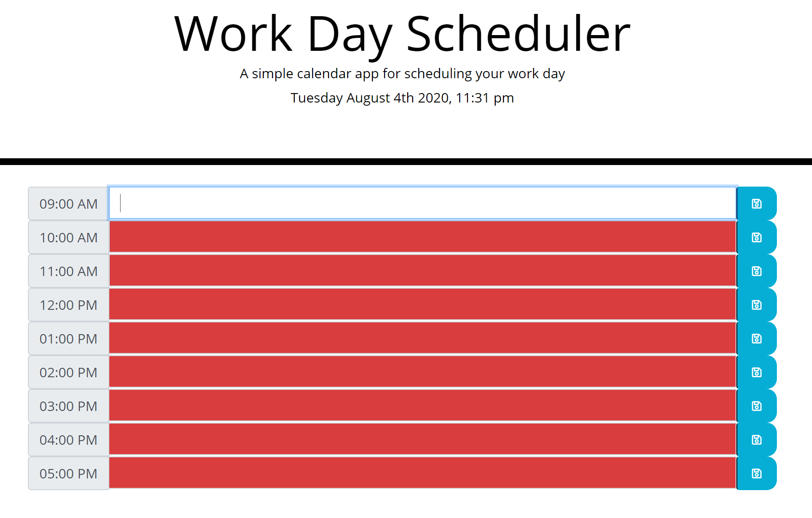

# Work-Day-Scheduler

<a href="https://shadysaleh01.github.io/Work-Day-Scheduler/">Work-Day-Scheduler IO</a>
 
<strong>Important events to a daily planner SO that you can manage your time effectively</strong>
 
<ul>
  <li>When you open the planner, then the current day is displayed at the top of the calendar</li>
  <li>When you scroll down, then you presented with timeblocks for standard business hours</li>
  <li>When you view the timeblocks for that day, then each timeblock is color coded to indicate whether it is in the past, present, or future</li>
  <li>When you click into a timeblock, then you can enter an event</li>
  <li>When you click the save button for that timeblock, then the text for that event is saved in local storage</li>
  <li>When you refresh the page, then the saved events persist</li>
</ul>
 

